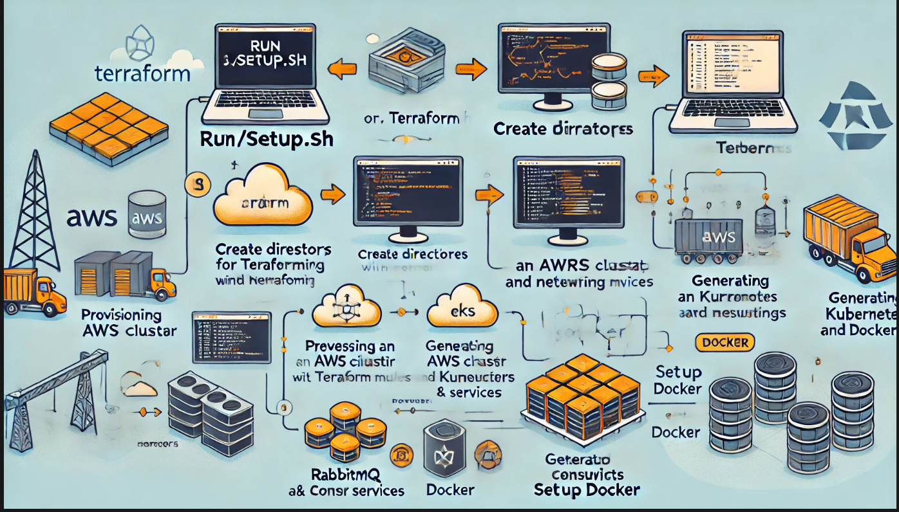

# JavaSpringBoot Modules deployed using a script in AWS!

## Assumptions
* I'm assuming fire and forget approach - API endpoint is publishing message and not waiting for confirmation, returning HTTP 202 Accepted because data will be processed later in consumer
* I'm assuming that client application is holding the state of booking, and is able to use generated UUIDs for PUT and DELETE operations

## Solution 

### Modules
* booking-producer-service - Implements API, basic validation and produce RabbitMQ messages.
* booking-consumer-service - Implements RabbitMQ listeners, "business logic" and persistence.
* booking-contract - contains DTO objects and Consts shared between both applications. This module is communication contract.

### Known issues/limitations
* error handling is limited to bare minimum - real world application should handle much more edge cases based on requirement
* only integration test provided - because application has almost no business logic I provided only integration tests. Test coverage is > 80%.
* faulty, not processed messages are redirected to Dead Letter Queue 

### Endpoints documentation
Endpoints documentation is generated on the fly in OpenAPI format by booking-producer-service
http://localhost:8080/swagger-ui/index.html

### Deployment of the script

Once you run **setup.sh** the following detailed Script Actions will occur:

**1. Directory Setup**
Creates directories for:
Terraform modules and environments.
Kubernetes manifests for RabbitMQ, producer, consumer, configmaps, and secrets.
Docker configurations for producer and consumer services.

**2. Terraform Modules**
EKS Module:
Provisions an EKS cluster with managed node groups.
Configures public/private endpoint access.
Specifies instance types and scaling properties for the node groups.
Networking Module:
Creates a VPC with public and private subnets.
Enables a single NAT gateway.
Tags resources appropriately for Kubernetes.

**3. Terraform Environment Configuration**
Environment-specific files include:
provider.tf: Defines AWS and Kubernetes providers.
main.tf: Integrates the networking and EKS modules.
variables.tf: Defines configurable parameters (e.g., region, subnets).

**4. Kubernetes Manifests**
Producer:
Defines a deployment and service for a booking-producer application.
Configures liveness/readiness probes, resource limits, and environment variables from a config map.
Consumer:
Similar to the producer, with its deployment and configuration.
RabbitMQ:
Configures RabbitMQ as a stateful service with liveness/readiness probes.
Exposes ports for AMQP and management interfaces.

**5. Docker**
Prepares directory structure for producer and consumer Dockerfiles, though no specific Dockerfiles are created in this script.
Purpose
This script is designed to bootstrap an environment for deploying an application involving:

**AWS Infrastructure:**
Sets up the networking and compute resources using Terraform.
Kubernetes Cluster:
Configures EKS for container orchestration.
Application Deployment:
Provides manifests for deploying services like RabbitMQ, producer, and consumer in Kubernetes.
Docker Preparation:
Sets up a directory for building Docker images for the applications.

**Usage**
Pre-requisites (use the commands below to check if you have anything missing)
* AWS CLI configured with access credentials: aws --version
* **IE generate both Access and Secret Key on AWS IAM**
* Kubernetes: **kubectl version --client**
* Terraform: **terraform version**
* Docker: **docker --version**
* GIT: **git --version**
* JAVA: **java -version**
* MAVEN: **mvn -version**

* If any of the above is missing
* **sudo apt update** (followed by)
* **sudo apt install** (application name)

* WSL2 environment (mine is Ubuntu)
* **cat /etc/os-release** 

**Setup**
* **aws configure** 
* AWS Access Key ID [****************5YIV]: 
* AWS Secret Access Key [****************L8ts]: 
* Default region name [us-east-1]: 
* Default output format [None]:
* **NOTE: put in the Access key and Secret Access Key you created earlier in IAM with the region name. Press enter after entry (choose None for Default output format)**

* From the Linux CLI: **git clone https://github.com/costas778/JavaSpringBoot.git**
* from the root of the folder structure locate the setup.sh, and use the following command: **chmond +x setup.sh**
* finally, type in he Linux CLI the following: **./setup.sh**

* You should get the following:

**Testing**
* #Check the pods
* **kubectl get pods -w**
  
* NAME                                READY   STATUS    RESTARTS   AGE
* booking-consumer-6d9f74974-84xlw    1/1     Running   0          12h
* booking-consumer-6d9f74974-slf9r    1/1     Running   0          12h
* booking-producer-845b699bdd-56qlm   1/1     Running   0          8h
* booking-producer-845b699bdd-j7s6l   1/1     Running   0          8h
* rabbitmq-5cfd974bf6-zd8xm           1/1     Running   0          33h

